

  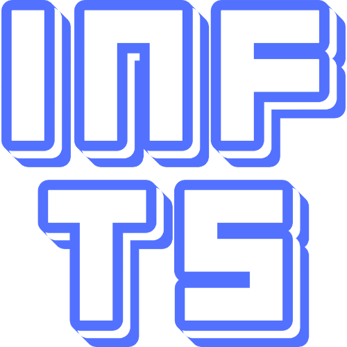

<h1 align="center">INF TimeStamper</h1>

- INFINITAS タイムスタンプ自動記録ツール -

## 概要

本ツールは beatmania IIDX INFINITAS の YouTube 配信を行う配信者向けのタイムスタンプ自動記録ツールです。 
[Reflux](https://github.com/olji/Reflux) の出力ファイルを利用し、選曲タイミングに合わせてタイムスタンプの記録及びコピー機能を提供します。

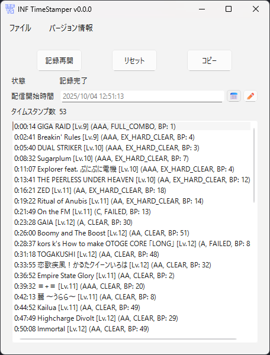

記録されたタイムスタンプを YouTube 配信アーカイブの概要欄に掲載することで、**選曲タイミングの動画時間にジャンプできる**ようになり、プレイの振り返りやリスナのアーカイブ視聴の補助としてご活用できます。
また、YouTube アカウントの条件を満たすことで[動画チャプター](https://support.google.com/youtube/answer/9884579?hl=ja)としても利用可能です。

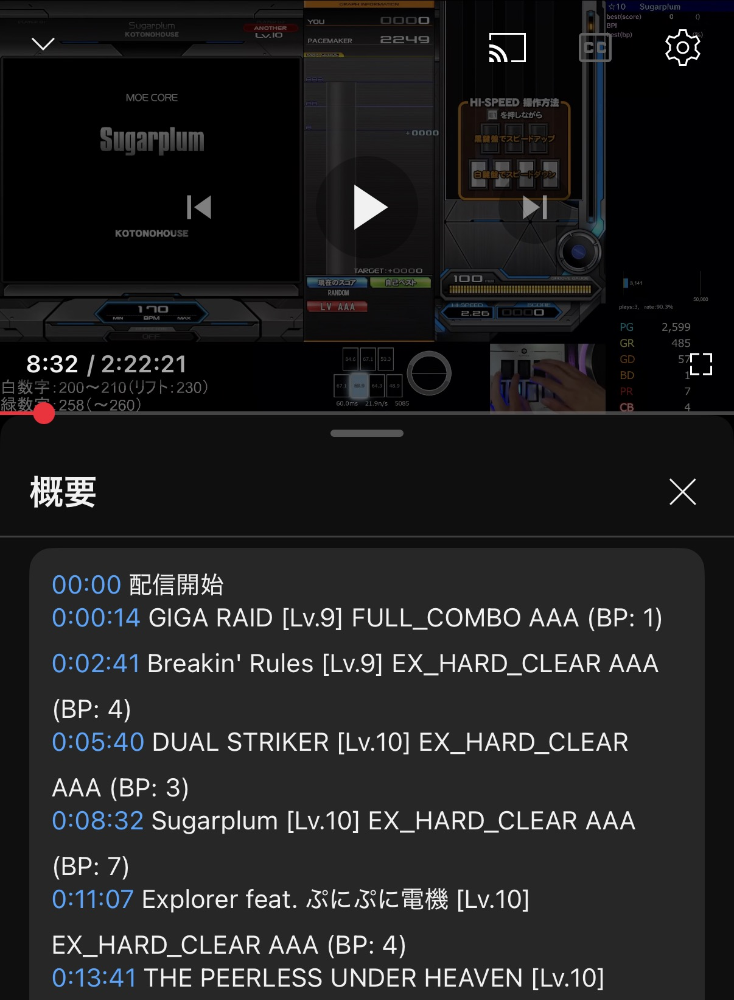

## 動作環境

- OS: Windows 10 / 11 (64bit) で確認済み
- 必須ソフト: [Reflux](https://github.com/olji/Reflux)
- 任意ソフト: [OBS Studio](https://obsproject.com/) バージョン 28 以降
  - 配信開始/終了に合わせてタイムスタンプを自動記録したい場合に必要

## 導入方法

下記の手順で初期設定を行ってください。

### 1. Reflux のインストール

1. Reflux の[Release](https://github.com/olji/Reflux/releases)ページにアクセス
2. 最新バージョンの Assets を開く
3. Reflux._a.b.c_.7z をクリックしてダウンロード (*a.b.c*はバージョンになります)
4. ダウンロードした 圧縮ファイルを任意の場所に展開

### 2. INF TimeStamper のインストール

1. [Release](https://github.com/Freedom645/inf-TimeStamper/releases)ページにアクセス
2. 最新バージョンの Assets を開く
3. InfTimeStamper.zip をクリックしてダウンロード
4. ダウンロードした 圧縮ファイルを任意の場所に展開

### 3. INF TimeStamper の設定

ツールの使用にあたり最低限の設定手順になります。
手順以外の設定項目については[その他の設定](#その他の設定)の章を参照ください。

1. InfTimeStamper を展開したフォルダ内の InfTimeStamper.exe をクリックして起動
2. ツールバーの フォルダ > 設定 をクリックして、設定ウィンドウを開く
3. 「基本設定」タブを開く
4. 「参照」ボタンをクリックし、Reflux を展開したフォルダ (Reflux.exe があるフォルダ) を選択
   

## 使い方

基本的なツールの使用方法は下記になります。

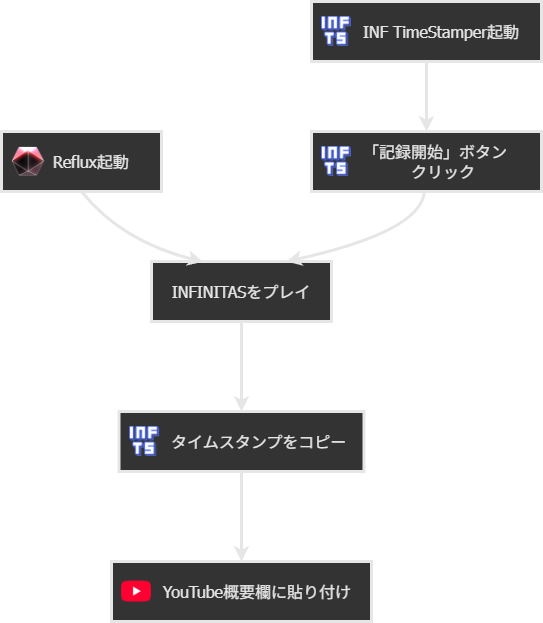

タイムスタンプが登録された状態で「コピー」ボタンをクリックすることで、クリップボードにタイムスタンプを一括コピーできます。
コピーしたデータは YouTube ライブの概要欄等にペーストしてご利用ください。

## その他の設定

### タイムスタンプのフォーマット変更

アプリ内表示及びコピー時のタイムスタンプのフォーマットを変更することが可能です。

1. 「基本設定」タブを開く
2. 「タイムスタンプフォーマット」の入力フォームを編集する
   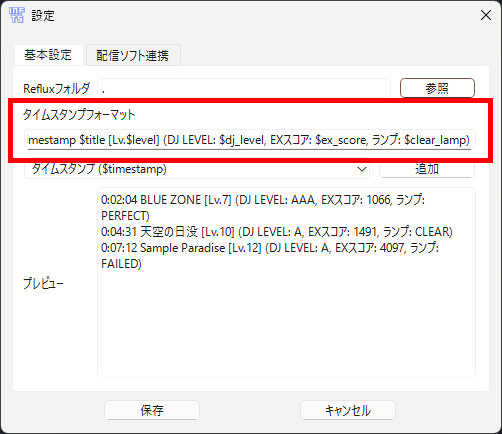

タイムスタンプフォーマットには「フォーマット識別子（`$xxxxx`）」と呼ばれる専用の文字列を挿入することで、実際の選曲やプレイリザルトに応じた内容が適用されます。
プレビューを確認しながらカスタマイズしてみてください。

**フォーマット識別子**

| 表示内容       | フォーマット識別子 |
| -------------- | ------------------ |
| タイムスタンプ | $timestamp         |
| タイトル       | $title             |
| レベル         | $level             |
| 難易度         | $difficulty        |
| DJ レベル      | $dj_level          |
| EX スコア      | $ex_score          |
| ランプ         | $clear_lamp        |
| :              | :                  |

※その他の識別子はアプリ内のプルダウンをご確認ください

### OBS Studio との連携 (オプション機能)

OBS Studio で配信している場合、INF TimeStamper で連携設定することで**配信開始時間の自動設定が可能**です。
連携を有効にした状態で「記録開始」をすると、待機状態となり OBS Studio の配信開始と同時にタイムスタンプの記録が開始されるようになります。また、配信終了と同時に記録停止されます。

**注意:**

- 事前に OBS Studio で WebSocket サーバ設定を済ませておく必要があります。
- OBS Studio バージョン 28 以降が必要になります。

 WebSocketの設定と認証情報の確認方法 (クリックして開く) 

1. ツール > WebSocket サーバ設定 をクリック
   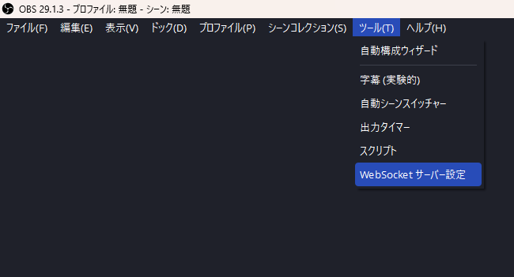
2. 「WebSocket サーバを有効にする」にチェック 
   ※本ツールは「認証を有効にする」も設定可能です
   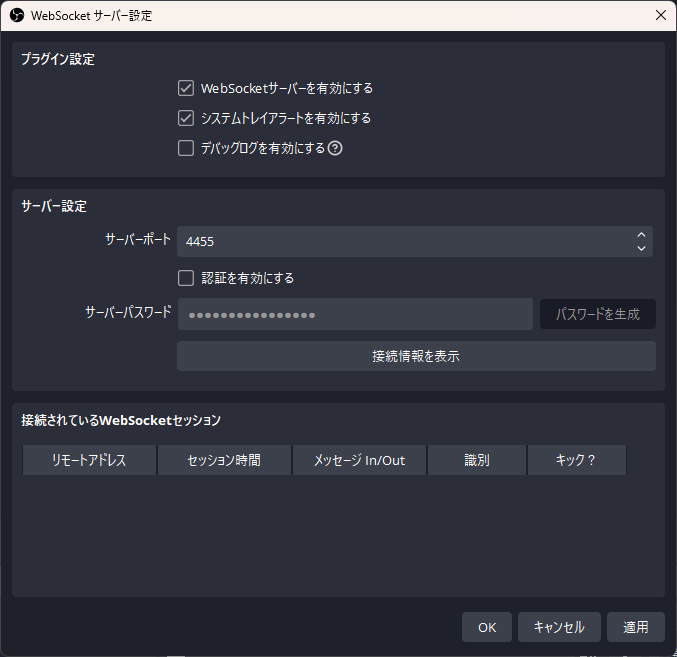
3. 「接続情報を表示」ボタンをクリックして、認証情報を確認する
   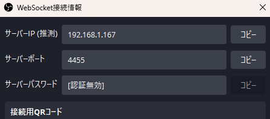

**INF TimeStamper の設定**

1. 「配信ソフト連携」タブを開く
2. 「OBS 連携を有効にする」のチェックを入れる
3. ホスト、ポートを入力（「認証を有効にする」を設定した場合はパスワードも必要です）
   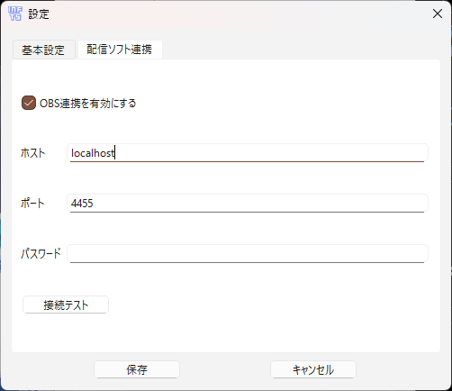

設定後に「接続テスト」をクリックすることで OBS に接続できるかテストできます。
接続テストに成功すると OBS のバージョンと選択されているシーン名が表示されます。
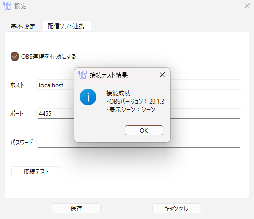

**OBS Studio 連携時の流れ** 
配信開始する前に INF TimeStamper の「記録開始」ボタンをクリックして待機状態にしておく必要があるため、ご注意ください。

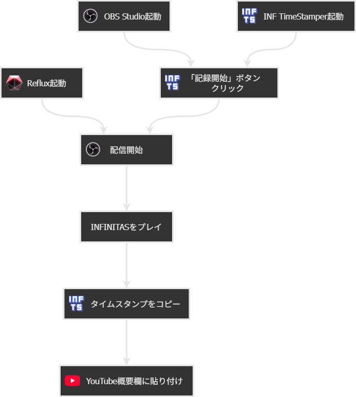

## 商標について

本 README に記載されている _beatmania IIDX_ の名称は、株式会社コナミデジタルエンタテインメントの日本およびその他の国における登録商標または商標です。

本ソフトウェアは非公式に開発されたツールであり、株式会社コナミデジタルエンタテインメントとは一切の提携・承認関係はありません。

## License

本ソフトウェアは PySide6 (Qt for Python) を利用しています。

PySide6 は LGPLv3 のもとでライセンスされています。
PySide6 のソースコードは以下で入手可能です:
https://code.qt.io/cgit/pyside/pyside-setup.git/

ユーザーは LGPLv3 の条件に従い、PySide6 を改変し、再リンクする権利を有します。

LGPLv3 ライセンス全文は LICENSES/LGPL-3.0.txt を参照してください。
