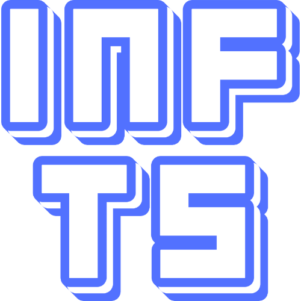
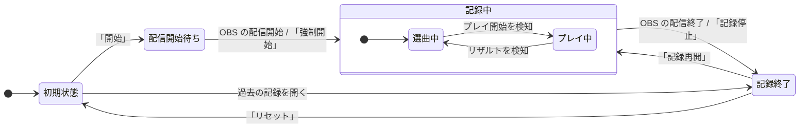

<div align="center">
  
</div>

<h1 align="center">INF-TIMESTAMPER</h1>
<p align="center">- 音楽ゲーム配信のタイムスタンプ自動記録ツール -</p>

<div align="center">

[](https://github.com/Freedom645/inf-timestamper/releases/latest)
[](https://github.com/Freedom645/inf-timestamper/releases)
[](https://github.com/Freedom645/inf-timestamper/blob/main/LICENSE)

</div>

音楽ゲーム配信の YouTube アーカイブ向けに、**チャプター用タイムスタンプを自動生成する Windows アプリ**です。

配信中にプレイした楽曲を自動で記録し、YouTube の概要欄にそのまま貼れる形式でクリップボードへコピーできます。

```
00:00:15 GIGA RAID [SPH 10] (AAA, FC)
00:02:41 Breakin' Rules [SPA 11] (AA, EX-HARD)
00:05:03 ACTØ [SPN 6] (D, FAILED)
```

## 対応ゲーム

| ゲーム | プレイ検知に使う外部ツール |
| --- | --- |
| コナステ版 beatmania IIDX INFINITAS | [Reflux](https://github.com/olji/Reflux) |
| pop'n music | 別途トラッカーが必要（下記） |

**1 配信 = 1 ゲーム**です。記録対象はメインウィンドウのゲーム選択で切り替えます（記録開始前のみ変更可能）。

### pop'n music について

pop'n のプレイ検知には、次の 2 ファイルを出力する外部トラッカーを別途用意する必要があります。**本アプリには含まれません。**

| ファイル | 内容 |
| --- | --- |
| `state.txt` | 画面状態を 1 行で出力（`選曲画面` / `プレイ中` / `プレイ終了` / `待機`） |
| `result.json` | プレイリザルト。`music`（`title` / `sheet` / `level`）、`rank_name`、`medal_name`、`score`、`judge.bad`、検知時刻 `time` を含む |

`result.json` はリザルト画面の表示から数秒遅れて書かれても構いません。本アプリは `state.txt` が `プレイ中` に変わった時刻をプレイ開始として記録し、その後 `result.json` が書き換わった時点で成績を紐づけます。書き出しは一時ファイル経由の置き換え（アトミック）を想定しています。

## 仕組み

- **配信の開始・終了**は OBS WebSocket から受け取ります。「記録中」へ遷移した時刻がタイムスタンプの基準（`00:00:00`）になります
- **プレイの開始・リザルト**は、上記の外部ツールが書き出すファイルを監視して取得します。画面キャプチャや OCR は使いません
- 記録は 1 配信 1 ファイルの JSON として自動バックアップされます（書き込み中にクラッシュしても壊れないアトミック保存）

OBS に繋がらない場合や、外部ツールを使わない場合でも、「強制開始」で手動記録に切り替えられます。

## 動作環境

- Windows 10 バージョン 2004（May 2020 Update）以降 / Windows 11、x64
- OBS Studio 28 以降（WebSocket サーバーが標準搭載されたバージョン）
- .NET ランタイムのインストールは不要です（self-contained な単一 exe）

## インストール

[Releases](https://github.com/Freedom645/inf-timestamper/releases) から `Setup.exe` をダウンロードして実行してください。

以降のバージョンアップは、起動時の自動チェックからアプリ内で更新できます（設定でオフにできます）。

## 使い方

### 1. 事前準備

**OBS 側**
「ツール」→「WebSocket サーバー設定」でサーバーを有効にし、ポートとパスワードを控えます。

**ゲーム側**
プレイ検知に使う外部ツールを起動し、その出力先フォルダを控えます。

- INFINITAS: Reflux が `playstate.txt` / `title.txt` / `level.txt` / `latest.json` を出力するフォルダ
- pop'n music: トラッカーが `state.txt` / `result.json` を出力するフォルダ

### 2. 設定

「ファイル」→「設定...」から、

- **配信ソフト連携タブ**: OBS のホスト・ポート・パスワードを入力し、「接続テスト」で疎通を確認します
- **INFINITAS タブ / pop'n music タブ**: 外部ツールの出力フォルダを指定し、タイムスタンプの書式を決めます

### 3. 記録

1. メインウィンドウでゲームを選択します
2. 「開始」を押すと `配信開始待ち` になります
3. OBS で配信を開始すると自動で `記録中` へ移ります（OBS を使わない場合は「強制開始」）
4. プレイするたびにタイムスタンプが増えていきます
5. 配信を終了すると `記録終了` になります
6. 「コピー」でリスト全体をクリップボードへコピーし、YouTube の概要欄に貼り付けます

時刻がずれた場合は、配信開始時間やタイムスタンプを右クリック →「日時を編集...」から 1 秒 / 10 秒 / 1 分単位で補正できます。

## 状態と操作

アプリは 4 つの状態を持ち、**記録操作ボタン 1 つが状態に応じて役割を変えます**。今どの状態にいるかはメインウィンドウの「状態」に表示されます。


```mermaid
stateDiagram-v2
    direction LR

    [*] --> 初期状態

    初期状態 --> 配信開始待ち : 「開始」
    配信開始待ち --> 記録中 : OBS の配信開始 / 「強制開始」
    記録中 --> 記録終了 : OBS の配信終了 / 「記録停止」
    記録終了 --> 記録中 : 「記録再開」
    記録終了 --> 初期状態 : 「リセット」
    初期状態 --> 記録終了 : 過去の記録を開く

    state 記録中 {
        direction LR
        [*] --> 選曲中
        選曲中 --> プレイ中 : プレイ開始を検知
        プレイ中 --> 選曲中 : リザルトを検知
    }
```

| 状態 | 記録操作ボタン | 何が起きているか |
| --- | --- | --- |
| 初期状態 | 開始 | 何も記録していない。ゲーム選択を変更できるのはこの状態だけ |
| 配信開始待ち | 強制開始 | OBS に接続し、配信が始まるのを待っている |
| 記録中 | 記録停止 | プレイを検知してタイムスタンプを追加していく |
| 記録終了 | 記録再開 | 記録を締めた状態。コピー・保存・「リセット」ができる |

**`記録中` に入った時刻がタイムスタンプの基準**（`00:00:00`）になります。その中で、プレイ開始を検知するたびに新しいタイムスタンプが 1 行増え、リザルトを検知するとその行に成績が書き足されます。

OBS が一時的に切断されても `記録中` のままで、自動的に再接続します（状態表示に試行回数が出ます）。`記録終了` へ移るのは「記録停止」を押したときと、配信が実際に終了していたことが分かったときだけです。

## タイムスタンプの書式

書式は設定画面で自由に組み立てられます。`$` から始まる識別子が実際の値に置き換わります。検知できなかった項目は空文字列になります。

**共通**（ゲームが変わっても意味が同じもの）

| 識別子 | 内容 |
| --- | --- |
| `$timestamp` | 配信開始からの経過時間（`hh:mm:ss`） |
| `$title` | 楽曲名 |
| `$level` | 譜面のレベル |
| `$diff_l` | 難易度（正式名） |
| `$diff_s` | 難易度（略式表記） |

**INFINITAS 固有**

| 識別子 | 内容 |
| --- | --- |
| `$dj_level` | DJ レベル（AAA〜F） |
| `$lamp` | クリアランプ（FAILED / A-EASY / EASY / NORMAL / HARD / EX-HARD / FC） |
| `$ex_score` | EX スコア |
| `$miss_count` | ミスカウント（BAD + POOR） |

**pop'n music 固有**

| 識別子 | 内容 |
| --- | --- |
| `$rank` | クリアランク（S / AAA / AA / A / B / C / D / E） |
| `$medal` | クリアメダル（青丸〜金星） |
| `$score` | スコア（0〜100000） |
| `$bad` | BAD 数 |

成績を表す項目はゲームごとに尺度が違うため、識別子も分けています。書式はゲームごとに別々に保存されます。

## 保存されるデータ

| 対象 | 場所 |
| --- | --- |
| 記録のバックアップ | `%APPDATA%\inf-timestamper\backups\`（設定で変更可） |
| 設定 | `%APPDATA%\inf-timestamper\settings.json` |
| ログ | exe と同じフォルダの `logs\app_yyyyMMdd.log`（7 日で自動削除） |

記録は配信開始時・プレイ追加時・編集時・配信終了時などに自動保存されます。アプリが異常終了しても、次回起動時に未完了の記録を検出して読み込み直せます。

## 開発

```powershell
dotnet build InfTimestamper.sln     # 警告 0 を維持する
dotnet test InfTimestamper.sln      # xUnit
dotnet run --project src/InfTimestamper -- --log-level=Debug
```

| ドキュメント | 内容 |
| --- | --- |
| [`docs/要件.md`](docs/要件.md) | 仕様の正本（UI・データ仕様・データ取得仕様） |
| [`docs/実装計画.md`](docs/実装計画.md) | フェーズ別の進捗と設計判断の記録 |
| [`docs/release.md`](docs/release.md) | publish → vpk pack → GitHub Releases の手順 |
| [`CLAUDE.md`](CLAUDE.md) | コードベースの構造メモ |

### 対応ゲームを増やすには

ゲーム固有の処理は `src/InfTimestamper.Core/Games/` の抽象に寄せてあります。追加時に触るのは次の 4 箇所です。

1. `Models/GameId` — enum とシリアライズ表記
2. `Games/GameCatalog` — 表示名・使える識別子・プレビュー用データ
3. `IPlayWatcher` の実装と、リザルト → 識別子の変換を行う FieldMapper
4. 設定ダイアログのタブと `AppSettings` のゲーム別セクション

## 経緯

本アプリは Python 実装（v0.6.1 まで公開）を C# / .NET 8 / WPF で全面的に書き直したものです。Python 版は `v0.6.1` タグに保存されています。**v0.x で作成したデータは v1.0 では読み込めません。**

当初は OBS のスクリーンショットに対する画像認識と OCR でプレイ内容を取得していましたが、装飾フォントに対する OCR の精度が上げられず、外部ツールのファイル監視方式へ切り替えました。画像認識まわりの実装は使われなくなったため削除しています（履歴は `v1.0.0` 以前のコミットに残っています）。

## ライセンス

[MIT License](LICENSE)
