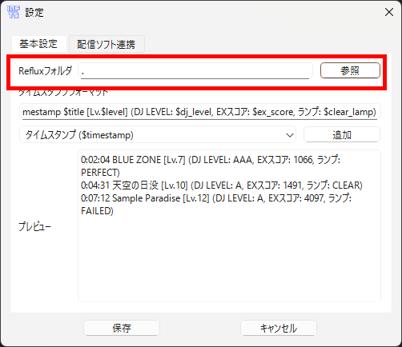

# INF Timestamper

本ツールは beatmania IIDX INFINITAS 用の YouTube 向けタイムスタンプ自動生成ツールです。

Reflux の出力ファイルを利用し、選曲タイミングに合わせて YouTube 配信アーカイブでジャンプできるタイムスタンプを生成します。

## 導入方法

下記の手順で初期設定を行ってください。

1. [Reflux](https://github.com/olji/Reflux) のインストール
2. INF Timestamper (本ツール) のインストール
3. INF Timestamper の設定

### 1. Reflux のインストール

1. Reflux の[Release](https://github.com/olji/Reflux/releases)ページにアクセス
2. 最新バージョンの Assets を開く
3. Reflux._a.b.c_.7z をクリックしてダウンロード (*a.b.c*はバージョンになります)
4. ダウンロードした 圧縮ファイルを任意の場所に展開

### 2. INF Timestamper のインストール

1. [Release](https://github.com/Freedom645/inf-timestamper/releases)ページにアクセス
2. 最新バージョンの Assets を開く
3. InfTimestamper.zip をクリックしてダウンロード
4. ダウンロードした 圧縮ファイルを任意の場所に展開

### 3. INF Timestamper の設定

ツールの使用にあたり最低限の設定手順になります。
手順以外の設定項目については[その他の設定](#その他の設定)の章を参照ください。

1. InfTimestamper を展開したフォルダ内の InfTimestamper.exe をクリックして起動
2. ツールバーの フォルダ > 設定 をクリックして、設定ウィンドウを開く
3. 「基本設定」タブを開く
4. 「参照」ボタンをクリックし、Reflux を展開したフォルダ (Reflux.exe があるフォルダ) を選択
   

## 使い方

基本的な流れは下記になります。

1. Reflux を起動する
2. InfTimestamper.exe を起動する
3. 記録開始をクリックする
4. INFINITAS をプレーする

タイムスタンプが登録された状態で「コピー」ボタンをクリックすることで、クリップボードにタイムスタンプを一括コピーできます。
コピーしたデータは YouTube ライブの概要欄等にペーストしてご利用ください。

## その他の設定

### タイムスタンプのフォーマット変更

アプリ内表示及びコピー時のタイムスタンプのフォーマットを変更することが可能です。

1. 「基本設定」タブを開く
2. 「タイムスタンプフォーマット」の入力フォームを編集する
   

タイムスタンプフォーマットには「フォーマット識別子（`$xxxxx`）」と呼ばれる専用の文字列を挿入することで、実際の選曲やプレイリザルトに応じた内容が適用されます。
プレビューを確認しながらカスタマイズしてみてください。

**フォーマット識別子**

| 表示内容       | フォーマット識別子 |
| -------------- | ------------------ |
| タイムスタンプ | $timestamp         |
| タイトル       | $title             |
| レベル         | $level             |
| 難易度         | $difficulty        |
| DJ レベル      | $dj_level          |
| EX スコア      | $ex_score          |
| ランプ         | $clear_lamp        |
| :              | :                  |

※その他の識別子はアプリ内のプルダウンをご確認ください

### OBS Studio との連携

OBS Studio で配信している場合、連携設定することで「配信開始時間の自動設定」が可能です。
連携を有効にした状態で「記録開始」をすると、待機状態となり配信開始と同時にタイムスタンプの記録が開始されるようになります。また、OBS の配信終了と同時に記録停止されます。

※連携する場合は事前に OBS Studio で WebSocket サーバ設定を済ませておく必要があります。
また、連携には OBS Studio バージョン 28 以降が必要になります

 WebSocketの設定と認証情報の確認方法 (クリックして開く) 

1. ツール > WebSocket サーバ設定 をクリック
   
2. 「WebSocket サーバを有効にする」にチェック 
   ※本ツールは「認証を有効にする」も設定可能です
   
3. 「接続情報を表示」ボタンをクリックして、認証情報を確認する
   

1. 「配信ソフト連携」タブを開く
2. 「OBS 連携を有効にする」のチェックを入れる
3. ホスト、ポートを入力（「認証を有効にする」を設定した場合はパスワードも必要です）
   

設定後に「接続テスト」をクリックすることで OBS に接続できるかテストできます。
接続テストに成功すると OBS のバージョンと選択されているシーン名が表示されます。

## License

本ソフトウェアは MIT License で配布しています。

ただし、本ソフトウェアは以下のライブラリを利用しています：

- PySide6 (LGPLv3)
- Qt (LGPLv3)

利用者は LGPLv3 に従って、PySide6 や Qt を差し替えて利用できます。
