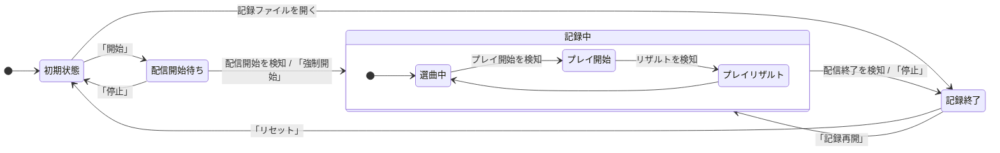

# INF-TIMESTAMPER 要件定義

## 概要

OBSを使った音楽ゲーム配信にてYouTube向けのタイムスタンプを作成するWindows用スタンドアロンアプリ。

配信開始時間とゲーム上のプレイ開始時間を記録し、YouTubeの配信アーカイブでその時間帯にジャンプ可能なタイムスタンプ形式の文字列（チャプター機能）を自動生成する。これにより自身のゲームプレイの振り返りを容易にする。

## 前段アプリと本リライトの位置付け

本プロジェクトは [Freedom645/inf-timestamper](https://github.com/Freedom645/inf-timestamper)（Python 実装、最新 v0.6.1）の **C# によるフルリライト**であり、**同一リポジトリで v1.0.0 メジャーバージョンとしてリリース**する。

- 言語選定の理由：Python 版の保守性課題（依存管理・パッケージング・型安全性）を解消する
- **データ互換性：v0.x の JSON 形式と v1.0 の JSON スキーマは非互換**。v1.0 では旧形式を読み込まない（クリーン切替）
- ブランチ戦略：`v0.6.1` タグで Python 実装を保存し、`main` を C# 実装で全面置換する
- セルフアップデート：v0.x の自前更新機構と v1.0 の Velopack は形式互換しないため、v0.6.x の最終版に「v1.0 が公開されました。手動で再インストールしてください」と告知するワンステップを挟む運用とする（v0.x 側の作業）

## 技術スタック

- 言語・ランタイム：C# / .NET 8
- GUIフレームワーク：WPF（MVVMパターン）
- 配布形態：single-file self-contained publish（単一exe、インストーラ不要）
- 主要ライブラリ（候補）
  - OBS WebSocket：OBSWebSocketDotNet（配信開始/終了の検知に使用）
  - ファイル監視：System.IO.FileSystemWatcher（標準。Reflux 出力の監視に使用）
  - JSON：System.Text.Json（標準）
  - 自己アップデート：Velopack
- 動作対象：Windows 10 / 11（x64）

## 機能

- タイムスタンプ記録機能
  - OBSと連携して配信開始/配信終了を検知し、タイムスタンプの基準となる日時を取得する
  - Reflux のファイル監視でプレイ開始タイミングの日時とプレイリザルトを取得する
    - Reflux が出力するファイル群（`playstate.txt` / `title.txt` / `level.txt` / `latest.json`）を監視し、プレイ開始タイミングの日時とプレイリザルトを取得する
- タイムスタンプコピー機能
  - ボタン押下で記録済みのタイムスタンプデータをクリップボードにコピーする
  - コピー時のフォーマットはユーザによりカスタマイズ可能可能にする（設定画面でフォーマット文字列で設定）
- 配信開始時間/タイムスタンプ時間編集機能
  - 手動で記録された時間を修正する機能
  - ラグなどにより配信アーカイブとのズレなどに対応できるようにする
  - 絶対時間又は相対時間（±1分、10秒、1秒）で編集可能にする
  - プレイ開始時間は複数選択で一括編集可能にする（複数選択時の修正方法は相対時間のみ）
- 各種設定
  - 基本設定グループ
    - 起動時の自動アップデートチェック有無
    - バックアップ保存先ディレクトリ
    - リセット/終了時の確認ダイアログ有無
  - 配信ソフト連携グループ
    - OBS接続情報
  - ゲーム設定グループ（INFINITAS）
    - タイムスタンプフォーマット文字列
    - Reflux 出力ディレクトリ
- バックアップ機能
  - タイムスタンプ記録はJSON形式のテキストファイルに出力してバックアップを取る
  - バックアップは1配信1ファイルとし
  - バックアップタイミングは下記などの記録に変更があったに上書きで保存する
    - 配信開始時
    - プレイ開始タイミング追加時
    - アプリ終了時
    - 時間編集時
- 自動バージョンアップ機能
  - 起動時にGitHubリポジトリのAPIを使用して最新バージョンをチェック
  - バージョン更新を検知した場合、アップデート要否をユーザに確認してセルフアップデートを実施する

## 対応ゲーム

対応するゲームは下記とする。

- コナステ版 beatmaniaIIDX INFINITAS（`game` = `INFINITAS`）
- pop'n music（`game` = `POPN`）
- SOUND VOLTEX（`game` = `SDVX`）

**1 配信 = 1 ゲーム**とし、記録対象のゲームはメインウィンドウのゲーム選択で決める（`初期状態` でのみ変更可能）。

識別子定義はゲーム別に持つ。**ゲーム間で意味が変わらない識別子（`$timestamp` / `$title` / `$level` / `$diff_l` / `$diff_s`）は共通で流用し、成績系のようにゲームごとに意味が異なるものはゲーム固有の識別子を新設する**（ハイブリッド方針）。タイムスタンプフォーマットもゲームごとに別々に保持する。

## UI

UIは下記2つのウィンドウを基本とする

- メインウィンドウ：アプリ機能全般で使用するウィンドウ
- 設定ウィンドウ：アプリに適用する設定を変更する子ウィンドウ
- アップデートウィンドウ：セルフアップデート時の進捗確認ウィンドウ

### メインウィンドウ

- 基本設定
  - アイコン：専用のアプリアイコンを表示
  - タイトル：アプリ名、バージョンを表示
  - サイズ：横幅固定、縦幅は最小のみ設定
  - レイアウト：サイズ変更時に表示崩れが起きにくいように対応する
- メニューバー
  - ファイルメニュー
    - 過去の記録を開く：ファイルダイアログより記録ファイルを選択して過去に記録したタイムスタンプデータを表示する
    - 記録を保存する：ファイルダイアログで記録ファイルを保存する（バックアップと同じ形式で手動操作の口となる）
    - 設定：
      - 設定ダイアログを開く
  - Aboutメニュー
    - バージョン情報：現在のバージョンを表示
    - 最新バージョンチェック：GitHubに新バージョンがあるかチェックしに行く
    - GitHub：GitHubリポジトリを既定のブラウザで表示
- コントロールエリア
  - 記録操作ボタン：下記の4種類のボタンを同一ボタンで各状態毎に分ける
    - 開始ボタン
      - 「初期状態」時に表示
      - OBSとのWebSocket通信を確立して記録開始までの待機状態にする
    - 強制開始ボタン
      - 「配信開始待ち」時に表示
      - OBSの配信開始検知なしで「記録中」に遷移させる
    - 記録停止ボタン
      - 「記録中」時に表示
      - OBSとのWebSocket通信を終了する
    - 記録再開ボタン
      - 「記録終了」時に表示
      - OBSとのWebSocket通信を確立する
  - リセット／停止ボタン：記録操作ボタンの隣に置き、状態に応じて役割を変える
    - リセット
      - 「初期状態」「記録中」「記録終了」時に表示
      - 現在の記録をリセットする。押下可能なのは「記録終了」時のみ
    - 停止
      - 「配信開始待ち」時に表示
      - OBS連携を解除して「初期状態」に戻す
      - 記録操作ボタンがこの状態では「強制開始」になるため、待機をやめる導線をここに置く
  - コピーボタン
    - 現在記録されているタイムスタンプをクリップボードにコピーする（タイムスタンプリストの表示内容と 1 行単位で一致させる。配信開始行を含む）
    - プレイ開始時間が記録されている場合にのみ押下可能

- 状態表示エリア
  - ゲーム選択コンボボックス
    - 記録対象のゲームを選択する（1 配信 = 1 ゲーム。JSON の `game` になる）
    - 「初期状態」でのみ変更可能。記録を開始したあとは無効化する
    - 選択を変更するとタイムスタンプフォーマットと監視ディレクトリが、そのゲームの設定に切り替わる
    - 選択内容は設定に永続化し、次回起動時に復元する
    - 過去記録の読込時は、ファイルの `game` に自動で合わせる
  - 状態ラベル
    - 状態遷移における各状態を表示
  - ヒントラベル
    - 現在マウスカーソルが当たっている箇所のUIについての概要や操作説明を表示する

- 記録表示エリア
  - 配信開始時間テキストラベル
    - 配信開始日時を読み取り専用で表示する
    - 配信開始時間がない場合は"-"表示する
    - 右クリックでポップアップメニューを表示し、日時編集ダイアログで編集ができる（記録がない場合は押下不可にする）
    - 配信開始日時が未設定（"-"）でもタイムスタンプが 1 件以上あれば編集できる。この場合の編集初期値は先頭のタイムスタンプの日時とする
  - タイムスタンプ数ラベル
    - プレイ開始記録数を整数で表示する
  - タイムスタンプリスト
    - スクロール可能なコンポーネントにプレイ開始記録を表示
    - 配信開始日時がある場合、先頭に「配信開始行」（`00:00:00 <見出し文言>`）を表示する
      - YouTube のチャプタ機能は先頭が 0 秒のチャプタであることを要求するため
      - 表示/非表示と見出し文言は `基本設定タブ` で設定する（既定：表示、`配信開始`）
      - プレイ記録ではないためチェックボックスを持たず、選択・日時編集・バックアップ JSON への保存の対象外
    - 常に日時昇順でソートされる
    - 配信開始日時より前の記録はマイナス表記にする
    - 表示形式は実際にクリップボードにコピーされるタイムスタンプ形式で常に表示する（設定変更直後も随時反映する）
    - 記録中は最新が表示され続けるように最後尾を自動追尾する
    - チェックボックスを表示し、下記の操作で複数選択可能にする
      - チェックボックスを直接クリック
      - Shift+クリックで範囲選択
      - Ctrl+クリックで複数選択
    - 右クリックポップアップメニューを表示し、日時編集ダイアログで編集ができる
- 日時編集ダイアログ
  - 配信開始時間又はタイムスタンプの編集で子ウィンドウとして表示される
  - 日時が表示されるテキストボックスを配置
    - 単一編集時は直接編集が可能
    - 文字列が日時フォーマットとして不正な場合は赤背景表示する
    - 複数編集時は最小の日時のみを読み取り専用で表示
  - 相対時間編集として下記のボタンを配置
    - -1分、-10秒、-1秒、+1秒、+10秒、+1分
    - 押下することで対応するボタンに応じて加減算する
  - 確定ボタン
    - 編集した内容をタイムスタンプ記録データに反映させる
    - 文字列が不正な場合は押下不可
  - 閉じるボタン
    - 何も反映せずにダイアログを閉じる

### 設定ウィンドウ

- 基本設定
  - アイコン：メインウィンドウと同じ
  - タイトル："設定"を表示
  - サイズ：縦横ともにすべてのUIが隠れないサイズで最小値のみ設定
  - レイアウト：サイズ変更時に表示崩れが起きにくいように対応する
- タブ
  - 基本設定タブ
    - 起動時の自動アップデートチェックチェックボックス
      - ON時はアプリ起動時にGitHub Releasesを照会し、新バージョン検出時にアップデート確認ダイアログを表示する
    - バックアップ保存先ディレクトリ
      - パステキストフィールドと「参照」ボタンを配置
      - 既定値：`%APPDATA%\inf-timestamper\backups\`
      - 不正なパスや書込権限なしの場合は赤背景表示
    - 確認ダイアログ表示チェックボックス
      - リセット時の確認ダイアログ有無
      - アプリ終了時の確認ダイアログ有無（記録中または未保存の編集がある場合のみ）
    - 配信開始行チェックボックス
      - ON 時、タイムスタンプリストとコピー結果の先頭に `00:00:00 <見出し文言>` の行を入れる
      - 既定値：ON
    - 配信開始行の見出し文言テキストフィールド
      - 既定値：`配信開始`。空の場合は既定値を使う
  - 配信ソフト連携タブ
    - OBS接続情報エリア
      - ホストテキストフィールド：IPアドレスv4形式又はチェックボックスでローカルホスト
      - ポート：整数値
      - パスワード：基本は隠し表示
      - 接続テストボタン：
        - 押下で実際に接続を試す
        - 成功した場合、OBSバージョンと表示中のシーンを取得してダイアログで成功の旨を表示
        - タイムアウトは3秒程度
        - 失敗の場合はエラー内容をダイアログで表示
  - INFINITASタブ
    - タイムスタンプフォーマットテキストフィールド
      - フォーマット文字列を入力可能
      - タイムスタンプ形式に変換するとこの文字列内の特定のフォーマット識別子"$xxx"が対応するデータに置換される
      - "$"の右隣にカーソルがある場合にサジェストされる（↑↓で候補移動、Enter / Tab で確定、Esc で閉じる。`$` に続けて入力した文字で候補を絞り込む）
      - サジェストの各行は `$識別子` と論理名を並べて表示する
    - 識別子セレクトボックス
      - 選択肢は `論理名 ($識別子)` 形式で表示する（キーだけでは意味が伝わらないため）
    - 識別子追加ボタン
      - セレクトボックスで選択中の識別子が「タイムスタンプフォーマットテキストフィールド」のカーソル上に追加される
    - プレビューエリア
      - 現在編集中のタイムスタンプフォーマットでどのように表示されるかリアクティブに表示する
      - 表示元のデータは存在しないタイムスタンプデータをハードコードで持って表示する
    - Reflux 出力ディレクトリテキストフィールド
      - Reflux が `playstate.txt` / `latest.json` 等を出力するフォルダを指定する
      - 「参照」ボタンを横に配置し、押下でフォルダ選択ダイアログを開く
      - 未指定時はプレイ検知を行わない（配信開始/終了の記録のみ継続）
      - 記録中に変更した場合はファイル監視を張り直す
  - pop'n musicタブ
    - INFINITASタブと同じ構成（フォーマット・識別子セレクトボックス・識別子追加ボタン・プレビュー）。識別子セレクトボックスの中身は pop'n の識別子になる
    - popn-lively-tracker 出力ディレクトリテキストフィールド
      - `popn-lively-tracker` が `state.txt` / `result.json` を出力するフォルダを指定する
      - 「参照」ボタンを横に配置し、押下でフォルダ選択ダイアログを開く
      - 未指定時はプレイ検知を行わない（配信開始/終了の記録のみ継続）
  - SOUND VOLTEXタブ
    - INFINITASタブと同じ構成（フォーマット・識別子セレクトボックス・識別子追加ボタン・プレビュー）。識別子セレクトボックスの中身は SDVX の識別子になる
    - SDVX Helper のフォルダテキストフィールド（任意・推奨）
      - `sdvx_helper.exe` があるフォルダ（直下に `log/` が作られる場所）を指定する。「参照」ボタンでフォルダ選択ダイアログを開く
      - 指定すると `log/sdvx_helper.log` の画面遷移を監視し、プレイ画面に入った時刻をプレイ開始として記録する。リザルト画面からのリトライや、曲決定画面の取りこぼしがあってもこれで拾える
      - 未指定なら曲決定画面の検知だけになり、リトライは記録されない。その旨をフィールド下に注記する
    - SDVX Helper の接続先（ホスト・ポート）テキストフィールド
      - ポートは `SDVX Helper` の `WebSocketデータ配信ポート`（既定 8767）と同じ値を指定する
      - ホストは既定 `127.0.0.1`。「ローカルホスト」チェックボックスで既定値に戻せる（OBS 連携タブと同じ規則で IPv4 形式または `localhost` のみ許容）
      - **`SDVX Helper` のデータ配信サーバは localhost にしか bind しないため、別 PC の IP を指定しても接続できない。** ホストを設定可能にしているのはポートフォワード等を挟む場合のため。その旨をフィールド下に注記する
      - 不正値（IPv4 でないホスト、1〜65535 の範囲外のポート）は赤背景で表示する
      - 接続先（`ws://{ホスト}:{ポート}`）をフィールドの下に表示する
      - 記録中に変更した場合は接続を張り直す

#### 識別子について

ゲームごとに異なるタイムスタンプと紐づく付加情報項目。タイムスタンプとしてコピーする際にカスタマイズしたフォーマットに対して紐づくデータを置換してコピーする。

beatmaniaIID INFINITASでは下記とする。

| 項目               | フォーマット識別子 | 説明                                                                            |
| ------------------ | ------------------ | ------------------------------------------------------------------------------- |
| タイムスタンプ     | $timestamp         | 選曲したタイミングの時間。hh:mm:ss形式                                          |
| 楽曲名             | $title             | 選曲した楽曲名                                                                  |
| 難易度             | $diff_l            | 選曲した譜面の難易度。                                                          |
| レベル             | $level             | 選曲した譜面のレベル。1～12の整数。                                             |
| 難易度（略式表記） | $diff_s            | 選曲した譜面の略式表記の難易度。{SP,DP}{B,N,H,A,L}形式。（例：SPA、DPL）        |
| ミスカウント       | $miss_count        | プレイリザルトのミスカウント値。0以上の整数。                                   |
| DJレベル           | $dj_level          | プレイリザルトのDJレベル。F～A,AA,AAAの文字列。                                 |
| ランプ             | $lamp              | プレイリザルトのクリアランプ。{FAILED,A-EASY,EASY,NORMAL,HARD,EX-HARD,FC}形式。 |
| EX スコア          | $ex_score          | プレイリザルトのEXスコア。0以上の整数。                                         |

例えば、下記のようなフォーマットを設定したとする。

```
$timestamp $title [$diff_s] ($dj_level, $lamp)
```

下記のようなタイムスタンプが画面上に表示及びコピーできるようになる。

```
00:00:15 GIGA RAID [SPH] (AAA, FC)
00:02:41 Breakin' Rules [SPA] (AA, EX-HARD)
```

pop'n musicでは下記とする。`$timestamp` / `$title` / `$level` / `$diff_l` / `$diff_s` はINFINITASと共通（意味が変わらないため流用）、成績系はpop'n固有の識別子を新設している。

| 項目               | フォーマット識別子 | 説明                                                                    |
| ------------------ | ------------------ | ----------------------------------------------------------------------- |
| タイムスタンプ     | $timestamp         | プレイを開始したタイミングの時間。hh:mm:ss形式                          |
| 楽曲名             | $title             | 選曲した楽曲名                                                          |
| 難易度             | $diff_l            | 選曲した譜面の難易度。{EASY,NORMAL,HYPER,EX}形式。                      |
| レベル             | $level             | 選曲した譜面のレベル。1～50の整数。                                     |
| 難易度（略式表記） | $diff_s            | 選曲した譜面の略式表記の難易度。{E,N,H,EX}形式。                        |
| クリアランク       | $rank              | このプレイのクリアランク。{S,AAA,AA,A,B,C,D,E}形式。                    |
| クリアメダル       | $medal             | このプレイのクリアメダル名。{青丸,青菱,青星,若葉,銅丸,銅菱,銅星,銀丸,銀菱,銀星,金星}形式。 |
| スコア             | $score             | このプレイのスコア。0～100000の整数。                                   |
| BAD数              | $bad               | このプレイのBAD数。0以上の整数。pop'nはBADのみコンボが切れる。          |

```
$timestamp $title [$diff_l $level] ($rank, $medal)
```

```
00:00:15 Sorrows [NORMAL 29] (AA, 銅星)
00:04:52 ロマンシングエスケープ [NORMAL 19] (A, 銅菱)
```

SOUND VOLTEXでは下記とする。`$timestamp` / `$title` / `$level` / `$diff_l` / `$diff_s` はINFINITASと共通、`$score` はpop'n、`$ex_score` はINFINITASと共通（いずれも「そのプレイの得点」という意味が変わらないため流用）。クリアランプ・グレードはINFINITASと体系が違うためSDVX固有の識別子を新設している。

| 項目               | フォーマット識別子 | 説明                                                                    |
| ------------------ | ------------------ | ----------------------------------------------------------------------- |
| タイムスタンプ     | $timestamp         | 曲を決定したタイミングの時間。hh:mm:ss形式                              |
| 楽曲名             | $title             | 選曲した楽曲名                                                          |
| 難易度             | $diff_l            | 選曲した譜面の難易度。{NOVICE,ADVANCED,EXHAUST,MAXIMUM}形式。           |
| レベル             | $level             | 選曲した譜面のレベル。1～20の整数。                                     |
| 難易度（略式表記） | $diff_s            | 選曲した譜面の略式表記の難易度。{NOV,ADV,EXH,MXM}形式。                 |
| グレード           | $grade             | このプレイのグレード。{S,AAA+,AAA,AA+,AA,A+,A,B,C,D}形式。              |
| クリアランプ       | $clear_lamp        | このプレイのクリアランプ。{PLAYED,COMP,EXC-COMP,MAXXIVE,UC,PUC}形式。   |
| スコア             | $score             | このプレイのスコア。0～10000000の整数。                                 |
| スコア（千点表記） | $score_short       | `$score` を1000で割った整数。SDVXでは千点単位で読むことが多いため用意。 |
| EX スコア          | $ex_score          | このプレイのEXスコア。0以上の整数。リザルト画面がEXスコア表示のときのみ取得できる。 |

```
$timestamp $title [$diff_s $level] ($grade, $clear_lamp)
```

```
00:00:15 999 [MXM 20] (S, PUC)
00:03:28 Garakuta Soul Pray [ADV 13] (AAA+, UC)
```

## 状態遷移

状態遷移はゲーム共通で下記とする。



1. 初期状態
   - アプリ起動時の状態とする
   - 「記録を開く」メニューで記録ファイル開くと「記録終了」に遷移する
   - 「開始」ボタン押下で「配信開始待ち」に遷移する
2. 配信開始待ち
   - OBS連携（WebSocket通信を確立）し、配信開始を待つ
   - **接続が確立した時点で OBS が既に配信中だった場合は、その場で「記録中」に遷移する**（配信を始めてからアプリを起動したケース。OBS の配信状態イベントは変化時にしか飛ばないため、接続直後に実状態を問い合わせる）
   - 「停止」ボタン押下でOBS連携を解除して初期状態に戻す
   - OBS連携で配信開始を検知又は「強制開始」ボタン押下で「記録中」に遷移する
3. 記録中
   - 遷移タイミングを「配信開始時間」として日時を記録し、タイムスタンプ算出時の基準日時とする
     - OBS の配信開始検知でも「強制開始」ボタンでも同じ扱いとする（`stream.startedAt` が必ず入る）
   - 記録中は下記の通り別途状態遷移がありゲームの状態を検知してタイムスタンプデータを記録し続ける
     1. プレイ開始
        - INFINITAS では Reflux の `playstate.txt` が `play` に遷移したことを検知して遷移する
        - pop'n music では `popn-lively-tracker` の `state.txt` が `プレイ中` に遷移したことを検知して遷移する
        - SOUND VOLTEX では `SDVX Helper` のログ（`log/sdvx_helper.log`）に「プレイ画面へ遷移」が書かれたことを検知して遷移する。SDVX Helper のフォルダが未設定なら、曲決定画面で配信される `nowplaying` で代用する
        - このタイミングをタイムスタンプの時間として記録する（INFINITAS は `title.txt` / `level.txt`、SOUND VOLTEX は `nowplaying` から楽曲名・難易度・レベルを取得。pop'n はこの時点では曲情報を取得できない）
     2. プレイリザルト
        - INFINITAS は `playstate.txt` が `play` から離脱したことを検知して遷移し、`latest.json` からプレイ結果を取得する
        - pop'n music は `result.json` の書き換えを検知して遷移する（リザルト画面の表示から数秒遅れるため、`state.txt` のエッジでは判定しない）
        - SOUND VOLTEX は `SDVX Helper` がリザルト登録時に配信する `today_results` を検知して遷移し、その最新エントリからプレイ結果を取得する
   - OBSとのWebSocket通信で配信終了を検知する又はユーザによる「停止」ボタンがが押下された場合に「記録終了」に遷移する
4. 記録終了
   - 遷移タイミングを `stream.endedAt` として記録する（OBS の配信終了検知でも「停止」ボタンでも同じ扱い）
   - 「記録再開」を押下すると再度「記録中」に遷移する（`stream.endedAt` は null に戻す）。
   - 「リセット」ボタンを押下するとメモリ上のデータを破棄して「初期状態」に遷移する。

## データ仕様

### バックアップファイル

- 1配信1ファイルとし、JSON形式で出力する
- ファイル名規則：`{ゲーム}_{配信開始日時}.json`
  - 例：`INFINITAS_20260507_200000.json`
  - 配信開始日時はローカルタイム`yyyyMMdd_HHmmss`形式
  - 過去記録読込時は元ファイル名を保持し、上書き保存時は同名で書出す
- 文字コードはUTF-8（BOMなし）、改行はLF
- インデントは2スペース（人間が中身を確認しやすくするため）

### スキーマ

```json
{
  "schemaVersion": 1,
  "app": {
    "name": "inf-timestamper",
    "version": "1.0.0"
  },
  "game": "INFINITAS",
  "stream": {
    "startedAt": "2026-05-07T20:00:00+09:00",
    "endedAt":   "2026-05-07T22:34:12+09:00"
  },
  "createdAt": "2026-05-07T20:00:00+09:00",
  "updatedAt": "2026-05-07T22:34:12+09:00",
  "timestamps": [
    {
      "id": "01HZ7M5R3K8X4N9PY7QW2BVD8C",
      "playStartedAt": "2026-05-07T20:01:15+09:00",
      "fields": {
        "title": "GIGA RAID",
        "diff_l": "ANOTHER",
        "diff_s": "SPA",
        "level": 11,
        "miss_count": 5,
        "dj_level": "AAA",
        "lamp": "FC",
        "ex_score": 1820
      }
    }
  ]
}
```

### フィールド定義

| パス | 型 | 必須 | 説明 |
| --- | --- | --- | --- |
| `schemaVersion` | integer | ✓ | スキーマのメジャーバージョン。読込時に互換判定に使用 |
| `app.name` | string | ✓ | `"inf-timestamper"` 固定 |
| `app.version` | string | ✓ | 出力時のアプリバージョン（SemVer） |
| `game` | string | ✓ | ゲーム識別子。`INFINITAS` / `POPN` / `SDVX`。将来のゲーム追加に備えた拡張可能フィールド |
| `stream.startedAt` | string (ISO 8601) | ✓ | 配信開始日時。「記録中」状態への遷移タイミング |
| `stream.endedAt` | string (ISO 8601) または null | ✓ | 配信終了日時。記録中はnull |
| `createdAt` | string (ISO 8601) | ✓ | ファイル新規作成日時。以降変更しない |
| `updatedAt` | string (ISO 8601) | ✓ | 最終保存日時。保存ごとに更新する |
| `timestamps` | array | ✓ | プレイ開始記録の配列。`playStartedAt` 昇順を保つ |
| `timestamps[].id` | string (ULID) | ✓ | 一意識別子。複数編集時の対象特定や差分検出に使う |
| `timestamps[].playStartedAt` | string (ISO 8601) | ✓ | プレイ開始日時。`stream.startedAt` より前の値も許容（表示時にマイナス表記） |
| `timestamps[].fields` | object | ✓ | 識別子名（`$`抜き）→ 値のマップ。検知できなかったキーは省略する |

### 日時フォーマット

- ISO 8601 拡張形式 + タイムゾーンオフセット（例：`2026-05-07T20:01:15+09:00`）
- 秒精度（ミリ秒は不要）
- 出力時のローカルタイムゾーンを保持する
- .NET の `DateTimeOffset` でシリアライズ／デシリアライズする

### ID

- ULID（26文字、Crockford's Base32）を採用
- 生成順にソート可能な特性により、`playStartedAt` 衝突時のソート安定性を担保する
- .NET 実装は `NUlid` 等を想定

### フォーマット展開時の振る舞い

- フォーマット文字列中の識別子（例：`$miss_count`）に対応する `fields` キーが存在しない、または値が null の場合、**空文字列に展開**する
- 数値型フィールドは数値のまま保存し、フォーマット展開時に文字列化する（書式指定は将来拡張）

### スキーマの前方互換性ルール

- `schemaVersion` が自身より大きいファイルを読込もうとした場合、警告ダイアログを表示して読込を中止する
- 既知の旧 `schemaVersion` は内部でマイグレーションして読込む
- 不明な `game` 値は警告ダイアログを表示して読込を中止する
- `fields` 内の不明な識別子キーは破棄せず保持し、書出し時に元のまま戻す（現行フォーマットからは展開対象外。将来の識別子追加に備える）

### メモリ上のデータモデル

- スキーマと同等の構造をオブジェクトモデルで保持する
- 「現在の記録」と「読込中ファイル」は同一の参照を指す（読込時はファイル内容で上書き、リセット時は新規空インスタンスを生成）

### 保存タイミング

下記のタイミングでバックアップファイルへ上書き保存する。

- 「配信開始待ち」→「記録中」遷移時（ファイル新規作成。ファイル名は確定した `stream.startedAt` から決め、以降そのセッション中は同じファイルへ上書きする）
- プレイ開始タイミング検知時（タイムスタンプ追加）
- 配信開始時間 / プレイ開始時間の編集確定時
- ゲーム状態（選曲中/プレイ開始/プレイリザルト）の遷移によりタイムスタンプ `fields` が更新された時
- 「記録中」→「記録終了」遷移時（`stream.endedAt` 確定）
- 「記録終了」→「記録中」遷移時（記録再開。`stream.endedAt` を null に戻す）
- アプリ正常終了時

過去記録を開いた場合・異常終了復旧で読込んだ場合は、そのファイル自身を以降の上書き保存先とする。
バックアップ保存先が未設定の場合は自動保存を行わない（「記録を保存する」の手動保存のみ）。
アプリ終了時の確認ダイアログは、この自動保存で保存済みの場合は表示しない。

## データ取得仕様（INFINITAS）

INFINITAS のプレイ開始タイミングとプレイデータは、**Reflux が出力するファイル群のファイル監視**で取得する。
当初は OBS から取得したゲーム画面の画像認識（画像ハッシュ + OCR）で取得する方針だったが、OCR の精度向上が困難なため Reflux 方式へ切り替えた。
画像認識の実装は使われなくなったため削除済み（履歴は v1.0.0 以前のコミットに残る）。

### ファイル監視

- 監視対象：「INFINITAS タブ」の `Reflux 出力ディレクトリ` で指定したフォルダ
- `System.IO.FileSystemWatcher` で `playstate.txt` の変更を監視する
- `playstate.txt` は Reflux が出力するプレイ状態（`off` / `menu` / `play` 等）
- 状態の差分でエッジを判定する：
  - `off`/`menu` → `play`：**プレイ開始**。`title.txt` / `level.txt` を読む
  - `play` → 非 `play`：**プレイリザルト**。`latest.json` を読む
- `playstate.txt` 検知後、Reflux が `title.txt` / `level.txt` / `latest.json` を書き終えるのを待つため約 0.3 秒のデバウンスを挟む
- ファイルがロック中の場合は短い間隔で数回リトライする
- ディレクトリ未指定・監視開始失敗・読込失敗時はプレイ検知をスキップし、配信開始/終了の記録には影響しない（ダイアログは出さずログのみ）

### 識別子へのマッピング

`latest.json` の各フィールドを要件の識別子へ変換する。変換は `RefluxFieldMapper` に集約している（実出力と差異があれば変換表のみ調整）。実出力サンプル（`docs/sample/reflux/`）で全識別子の展開を確認済み。

| 識別子 | 取得元 | 変換 |
| --- | --- | --- |
| `$title` | `title`（プレイ開始時は `title.txt`） | そのまま。`unknown` は欠損扱い |
| `$level` | `level`（プレイ開始時は `level.txt`） | 整数。負値・非数値は欠損扱い |
| `$diff_l` | `diff` | 頭文字から正式名（BEGINNER/NORMAL/HYPER/ANOTHER/LEGGENDARIA） |
| `$diff_s` | `diff` の接頭辞 + `diff` | `{SP,DP}{B,N,H,A,L}`。**`playtype` はプレイヤーサイド（`P1`/`P2`）、`style` はオプション（`MIRROR` 等）で SP/DP ではない**ため、`diff` に接頭辞が無い場合の保険としてのみ明示的な `SP`/`DP` 表記を見る |
| `$dj_level` | `grade` | 直値（AAA/AA/A/B/C/D/E/F） |
| `$lamp` | `lamp` | F→FAILED, AC→A-EASY, EC→EASY, NC→NORMAL, HC→HARD, EX→EX-HARD, FC→FC, PFC→FC |
| `$miss_count` | `bad` + `poor` | BAD と POOR の合計。両方有効値のときのみ |
| `$ex_score` | `exscore` | 整数。負値は欠損扱い |

- 欠損・未知値のキーは `fields` に設定しない（フォーマット展開時は空文字列）

### 検知サイクルとタイムスタンプエントリ更新

| 状態遷移エッジ | 動作 |
| --- | --- |
| → プレイ開始（`play` 突入） | 新規タイムスタンプエントリを生成。`playStartedAt` = エッジ検知時刻。`title.txt` / `level.txt` から `$title` / `$level` を充填 |
| → プレイリザルト（`play` 離脱） | 直近のプレイ開始エントリの `fields` に `latest.json` 由来の各識別子（`$diff_*` / `$dj_level` / `$lamp` / `$miss_count` / `$ex_score` 等）をマージ |

- 同一プレイの重複登録を防ぐため、エントリ操作は状態遷移エッジ検知時のみ行う
- 同一状態の連続通知中はノーオペ

## データ取得仕様（pop'n music）

pop'n music のプレイ開始タイミングとプレイデータは、**`popn-lively-tracker` が出力するファイル群のファイル監視**で取得する。
入力仕様は `popn-lively-tracker` の `docs/file-output.md`（互換契約としてキー名・書き出しタイミングが固定されている）。実出力サンプルは `docs/sample/popn-tracker/`。

### ファイル監視

- 監視対象：「pop'n musicタブ」の `popn-lively-tracker 出力ディレクトリ` で指定したフォルダ
- `System.IO.FileSystemWatcher` で `state.txt` と `result.json` の**両方**を監視する
- `state.txt` は 1 行の画面状態（`選曲画面` / `プレイ中` / `プレイ終了` / `待機`）。シーンが一時的に取れないときは直前の状態を保つ（`待機` に落ちない）
- 状態の差分でエッジを判定する：
  - 非 `プレイ中` → `プレイ中`：**プレイ開始**。`playStartedAt` = エッジ検知時刻
- **リザルトは状態遷移のエッジでは読まない。** `result.json` は譜面の特定にレコード表の更新を待つため、リザルト画面の表示から数秒（`popn-lively-tracker` の既定タイムアウト 20 秒）遅れて書かれる。エッジで読むと直前のプレイのリザルトを拾ってしまう
  - プレイ開始後は「リザルト待ち」に入り、`result.json` 自身の書き換えを検知した時点で**プレイリザルト**とする
  - `result.json` の `time` がプレイ開始より前（1 秒の猶予つき）なら、前回プレイのリザルトとみなして捨てる
  - リザルト待ちでない状態での `result.json` の変化は無視する（起動直後に残っているファイルを拾わない）
- 書き出しは `.tmp` → `os.replace` のアトミック方式なので、監視側が中途半端な内容を読むことはない
- ディレクトリ未指定・監視開始失敗・読込失敗時はプレイ検知をスキップし、配信開始/終了の記録には影響しない（ダイアログは出さずログのみ）

### 識別子へのマッピング

`result.json` の各フィールドを pop'n の識別子へ変換する。変換は `PopnFieldMapper` に集約している。

| 識別子 | 取得元 | 変換 |
| --- | --- | --- |
| `$title` | `music.title` | そのまま |
| `$level` | `music.level` | 整数。1 以下は譜面なし扱いで欠損 |
| `$diff_l` | `music.sheet` | EASY / NORMAL / HYPER / EX |
| `$diff_s` | `music.sheet` | E / N / H / EX（EX は 1 文字にすると EASY と衝突するため 2 文字のまま） |
| `$rank` | `rank_name` | 直値（S/AAA/AA/A/B/C/D/E）。集合外は欠損 |
| `$medal` | `medal_name` | 直値。メダル名は改名実績があるため集合で弾かず素通しする |
| `$score` | `score` | 整数。0〜100000 の範囲外は欠損 |
| `$bad` | `judge.bad` | 整数。負値は欠損 |

- **`record` セクション（`record.clear_rank` / `record.medal` / `record.score`）と `previous_best` / `new_record` / `previous_medal` / `new_medal` は自己ベスト側の値であり、このプレイの成績ではない。取り込まない**
- 譜面が特定できなかったプレイ（`identified_by` = `特定できず`、`music` が `null`）は、曲情報（`$title` / `$level` / `$diff_*`）のみを欠損扱いにし、成績側（`$rank` / `$medal` / `$score` / `$bad`）はこのプレイの実測値として記録する
- 欠損・未知値のキーは `fields` に設定しない（フォーマット展開時は空文字列）

### 検知サイクルとタイムスタンプエントリ更新

| 状態遷移エッジ | 動作 |
| --- | --- |
| → プレイ開始（`プレイ中` 突入） | 新規タイムスタンプエントリを生成。`playStartedAt` = エッジ検知時刻。この時点では曲情報が取得できないため `fields` は空 |
| → プレイリザルト（`result.json` 書き換え検知） | 直近のプレイ開始エントリの `fields` に `result.json` 由来の各識別子をマージ |

- 同一プレイの重複登録を防ぐため、エントリ操作は状態遷移エッジ検知時のみ行う
- 同一状態の連続通知中はノーオペ。リザルトは 1 プレイにつき 1 回のみ発火する

## データ取得仕様（SOUND VOLTEX）

SOUND VOLTEX のプレイ開始タイミングとプレイデータは、**`SDVX Helper` のデータ配信 WebSocket の購読**で取得する。

INFINITAS / pop'n music と違いファイル監視ではない。`SDVX Helper` は v1.0 系まで `out/history_cursong.xml` を出力していたが、v2 系（v.2.0.0 以降）でファイル出力を廃止し、OBS ブラウザソース向けの WebSocket 配信へ移行している。本アプリは v2 系のデータ配信サーバに接続する。

### WebSocket 購読

- 接続先：`ws://{SOUND VOLTEXタブで指定したホスト}:{ポート}`（既定 `ws://127.0.0.1:8767`）
- サーバ側の設定項目は `SDVX Helper` の `websocket_data_port`（ホストは `localhost` 固定でユーザ設定不可）。**localhost にしか bind しないため、本アプリと `SDVX Helper` は同じ PC で動いている必要がある**
- 接続失敗・切断時は指数バックオフ（OBS 接続と同じ 1/5/10/30/60 秒）で再接続する。`SDVX Helper` が未起動でも配信開始/終了の記録には影響させない（ダイアログは出さずログのみ）
- 扱うメッセージは `nowplaying` と `today_results` の 2 種類。`hello` / `heartbeat` / `cursong` / `vf` / `stats` / `session_stats` は無視する

### ログ監視（プレイ開始の信号）

WebSocket にはプレイ開始そのもののイベントが無い。曲決定画面の `nowplaying`（後述）で代用すると、
**リザルト画面からのリトライ**（選曲も曲決定も通らない）を落とす。

一方 `SDVX Helper` は画面遷移のたびに `log/sdvx_helper.log` へ
`[yyyy-MM-dd HH:mm:ss,fff] [INFO] sdvx_helper.pyw:NNN:_on_mode_changed - モード変更: select → play`
のような行を書いており、これはリトライでも必ず出る。そこでこれをプレイ開始の信号にする。

- 監視対象：「SOUND VOLTEXタブ」の `SDVX Helper のフォルダ` 直下の `log/sdvx_helper.log`。フォルダ未指定なら監視しない
- `System.IO.FileSystemWatcher` で追記を検知し、追記分だけを読む（取りこぼし対策に 1 秒間隔のポーリングも併用）。監視開始前に書かれていた行は再生しない
- **`init` は状態として扱わない。** `SDVX Helper` の画面判定は暗転・演出・ロード中に頻繁に `init`（判定不能）へ落ちるため、実出力では遷移がほぼ全て `init` 経由になり、**1 プレイ中に `play → init → play` が何度も起きる**（実測サンプルでは `→ play` が 21 回出た区間の実プレイ数は 12）。`init` の行は直前の既知モードを保ったまま読み飛ばす
- **既知モードが `play` 以外から `play` に変わったとき**を**プレイ開始**とする。`playStartedAt` = 行頭の時刻（読めなければ検知時刻）
- 既知モードが `play` のまま再び `play` に入った場合（`play → init → play`）は同じプレイの継続として無視する
- `RotatingFileHandler`（2MB）でローテーションされるため、ファイルが縮んだら先頭から読み直す
- フォルダが存在しない・ログが読めない場合はログのみで、WebSocket だけで動作を続ける
- 実出力サンプルは `docs/sample/sdvx_helper/mode-changes.log`（実機ログの抜粋）。回帰テストがこれを読み、プレイ開始の回数が `SDVX Helper` のリザルト登録数と一致することを確認している

**曲情報（`nowplaying`）**

- `nowplaying` は「選曲画面でカーソルが動いたとき」と「曲決定画面（楽曲情報画面）を読めたとき」の 2 箇所から飛ぶ
- 選曲画面由来のペイロードは `images` にジャケットしか入らず、曲決定画面由来のものはタイトル / レベル / BPM / エフェクター / イラストレーターの切り出し画像も入る。**この差で曲決定画面由来のものだけを採る**
- 曲決定 1 回につき `nowplaying` は 1 通しか飛ばない（`SDVX Helper` 側が曲決定画面の読み取りを 1 回で打ち切るため）
- **これはプレイ開始ではなく曲情報のキャッシュとして扱う。** 曲決定画面由来のものでキャッシュを更新し、選曲画面由来のもの（＝別の曲を選び直している）でキャッシュを捨てる。プレイ開始時にその時点のキャッシュを `fields` に添える
  - 曲を決めてからプレイせずに選曲へ戻ることがあるため、曲決定ではエントリを作らない
  - リトライは `nowplaying` が飛ばないが、譜面は直前と同じなのでキャッシュがそのまま正しい
- ログ監視が無い（フォルダ未指定）ときに限り、曲決定画面の `nowplaying` をプレイ開始の代用にする。この場合リトライは記録されない

**プレイリザルト（`today_results`）**

- `today_results` はリザルトを `SDVX Helper` の DB へ登録した時点で飛ぶ。**`items` の中で `timestamp` が最大のエントリ**をこのプレイのリザルトとして採る
- `timestamp` がプレイ開始より前（2 秒の猶予つき）なら、前のプレイのものとみなして捨てる
- リザルト待ちでない状態での `today_results` は無視する（接続直後に本日分のキャッシュがまとめて飛んでくるため）
- リザルトは 1 プレイにつき 1 回のみ発火する（採用した時点でリザルト待ちを解除する）
- **`SDVX Helper` がリザルト画面を 2 回読み取り、同じプレイを 2 回登録することがある。** 登録ごとに `timestamp` がずれる（実測で 2 秒差）ため時刻では同一判定できないので、譜面（`chart_id`）と成績（`score` / `exscore` / `lamp`）が直前に採用したものと同じで、かつ 30 秒以内なら二重登録として捨てる

### 識別子へのマッピング

`nowplaying` / `today_results` の各フィールドを SDVX の識別子へ変換する。変換は `SdvxFieldMapper` に集約している。

| 識別子 | 取得元 | 変換 |
| --- | --- | --- |
| `$title` | `nowplaying.title` / `today_results.items[].title` | そのまま |
| `$level` | `nowplaying.level` / `today_results.items[].lv` | 整数。0 以下・数値でないものは欠損 |
| `$diff_l` | `difficulty` | NOVICE / ADVANCED / EXHAUST / MAXIMUM（未知の略称は略称のまま） |
| `$diff_s` | `difficulty` | NOV / ADV / EXH / MXM（`SDVX Helper` は INF/GRV/HVN/VVD/XCD を MXM 枠に統合して送る） |
| `$grade` | `today_results.items[].grade` | 直値（S/AAA+/AAA/AA+/AA/A+/A/B/C/D）。集合外は欠損 |
| `$clear_lamp` | `today_results.items[].lamp` | `clear_lamp` enum の値（0〜6）を PLAYED / COMP / EXC-COMP / MAXXIVE / UC / PUC へ変換。未知値は欠損 |
| `$score` | `today_results.items[].score` | 整数。0 以下・10,000,000 超は欠損 |
| `$score_short` | `today_results.items[].score` | `$score` を 1000 で割った整数 |
| `$ex_score` | `today_results.items[].exscore` | 整数。EX スコアはリザルト画面が EX スコア表示のときだけ読めるため、0 のときは欠損 |

- `today_results.items[].pre_score` / `pre_ex` / `is_score_updated` / `is_ex_updated` / `max_exscore` は自己ベストや理論値であり、このプレイの成績ではない。取り込まない
- 欠損・未知値のキーは `fields` に設定しない（フォーマット展開時は空文字列）

### 検知サイクルとタイムスタンプエントリ更新

| 検知 | 動作 |
| --- | --- |
| 曲決定画面由来の `nowplaying` | 曲情報（`$title` / `$diff_*` / `$level`）をキャッシュするだけ。エントリは作らない |
| 選曲画面由来の `nowplaying` | 曲情報のキャッシュを捨てる |
| → プレイ開始（ログで既知モードが `play` 以外から `play` へ） | 新規タイムスタンプエントリを生成。`playStartedAt` = ログの時刻。`fields` はキャッシュ済みの曲情報（無ければ空） |
| → プレイ開始（ログ監視が無いとき。曲決定画面由来の `nowplaying`） | 新規タイムスタンプエントリを生成。`playStartedAt` = 受信時刻。`fields` に曲情報を設定 |
| → プレイリザルト（`today_results` の最新エントリ） | 直近のプレイ開始エントリの `fields` に成績側の各識別子をマージ |

## エラーハンドリング・ログ・異常終了復旧

### ログ出力

- 出力先：exe と同じディレクトリの `logs/` サブフォルダ
- ファイル名：`app_yyyyMMdd.log`（日付ローテーション、1日1ファイル）
- ログレベル：`Trace` / `Debug` / `Info` / `Warn` / `Error` / `Fatal`
- 既定レベル：`Info`
- ログレベル切替：起動引数 `--log-level=Debug` で変更可能（MVPでは設定UIなし）
- 保持期間：直近 7 日。起動時に古いログを自動削除する
- フォーマット：`[yyyy-MM-dd HH:mm:ss.fff] [Level] [Category] Message`、1行1メッセージ
- 例外発生時はスタックトレースを含めて `Error` または `Fatal` で出力
- ライブラリ候補：`Microsoft.Extensions.Logging` + `Serilog`

### OBS WebSocket 接続再試行

- 接続切断を検知した場合、状態は「記録中」のまま維持し、自動再接続を試みる
- バックオフ間隔：1秒 → 5秒 → 10秒 → 30秒 → 以降60秒
- 状態ラベルに `OBS再接続中（試行 N 回目）` と表示
- 再接続が成功した時点で OBS の配信状態を問い合わせ、既に配信が終了していた場合は「記録終了」へ遷移する
- 設定ウィンドウで OBS 接続情報を変更した場合は、動作中の接続を張り直す（「停止 → 開始」を要求しない）
- 再接続成功後、配信状態の監視を即座に再開する
  - 再接続中に OBS 側で配信が既に終了していたことが判明した場合（再接続後に取得した配信状態が「未配信」など）は「記録終了」へ遷移する
- ユーザが「停止」ボタンを押した場合は再接続を中止して「記録終了」へ遷移する
- 接続テスト時のタイムアウトは 3 秒（既存仕様）、再接続時の各試行のタイムアウトは 5 秒

### プレイ検知の失敗

- ダイアログは表示しない（配信中のポップアップを避ける）
- 監視ディレクトリ未指定・監視開始失敗・ファイル読込失敗はプレイ検知をスキップし、ログにのみ記録する
- 監視対象ファイルの解析失敗（JSON の破損など）は Warn ログのみで、そのプレイの検知を諦める
- いずれの失敗も配信開始/終了の記録には影響しない（既存記録はメモリに保持される）

### ファイル I/O 失敗

- バックアップ書込失敗（権限不足／ディスク容量不足等）
  - Error ログを出力
  - 状態ラベルに `保存エラー` と表示
  - 記録自体は継続（メモリ保持）
  - 次回保存タイミングで再試行する
- アプリ終了時の最終保存失敗
  - ダイアログで通知（`保存先ディレクトリへの書込に失敗しました。保存先を変更してください`）
  - 保存先未確定のままアプリが落ちないよう、ダイアログを閉じるまで終了処理を保留する
- 過去ファイル読込失敗
  - JSON 構文エラー：`ファイルが破損しています` ダイアログを表示して読込中止
  - 自身より新しい `schemaVersion`：`より新しいバージョンで作成されたファイルです。アプリを最新版に更新してください` ダイアログを表示して読込中止
  - 不明な `game` 値：`対応していないゲームのファイルです` ダイアログを表示して読込中止

### GitHub API（自己アップデート）

- ネットワーク失敗
  - 起動時自動チェック：静かに諦める（Warn ログのみ、ダイアログなし）
  - 手動チェック（Aboutメニュー）：`最新バージョン情報の取得に失敗しました` ダイアログを表示
- レート制限超過：Warn ログを出力。手動チェックの場合はネットワーク失敗と同等の表示
- リリース不在・最新到達：手動チェック時のみ `現在のバージョンが最新です` ダイアログを表示
- 起動時チェックは `基本設定タブ` で OFF にできる（既存仕様）

### アトミック保存（Atomic Save）

バックアップファイルの保存は、書込中のクラッシュや電源断でファイルが破損しないよう、下記の手順で行う。

1. 同ディレクトリに一時ファイルを作成（例：`INFINITAS_20260507_200000.json.tmp`）
2. JSON 内容を書込み、`FileStream.Flush(true)` でディスクに確定する（fsync 相当）
3. 既存の正本ファイルが存在する場合、`.bak` 拡張子に退避リネームする
4. 一時ファイルを正本のファイル名にリネームする（`File.Move` 上書き有効版）
5. 退避した `.bak` ファイルを削除する

これにより、書込途中に異常終了しても、正本ファイルは常に直前の正常な状態を保持する。

### 異常終了からの復旧

- アプリ起動時に `バックアップ保存先ディレクトリ` をスキャンし、`stream.endedAt == null` のファイル（前回異常終了の可能性）を検出する
- 該当ファイルが存在する場合、起動直後に復旧確認ダイアログを表示する
  - メッセージ：`前回正常に終了されていない記録ファイルがあります。読み込みますか？`
  - 表示情報：ファイル名、最終更新日時、タイムスタンプ件数
  - 選択肢：`はい（読み込む）` / `いいえ（無視する）` / `削除する`
  - `はい`：「記録終了」状態で読込み、ユーザは「記録再開」で続きを記録できる
  - `いいえ`：何もせず通常起動。同ファイルは次回起動時にも再度提示される
  - `削除する`：ファイルをゴミ箱へ送る（即時完全削除はしない）
- 該当ファイルが複数ある場合は新しい順に順次提示する
- バックアップディレクトリへのアクセス権がない場合は復旧チェックをスキップして起動を継続する
